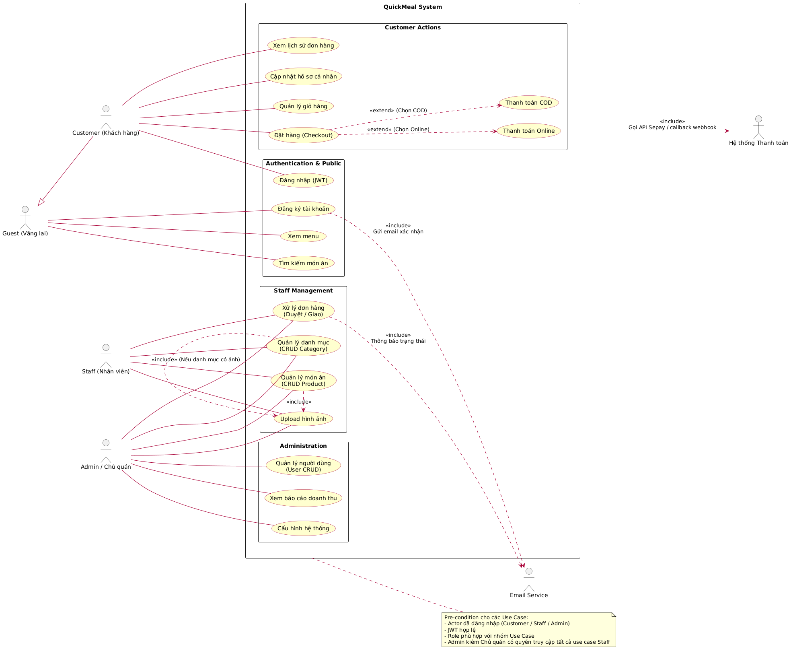
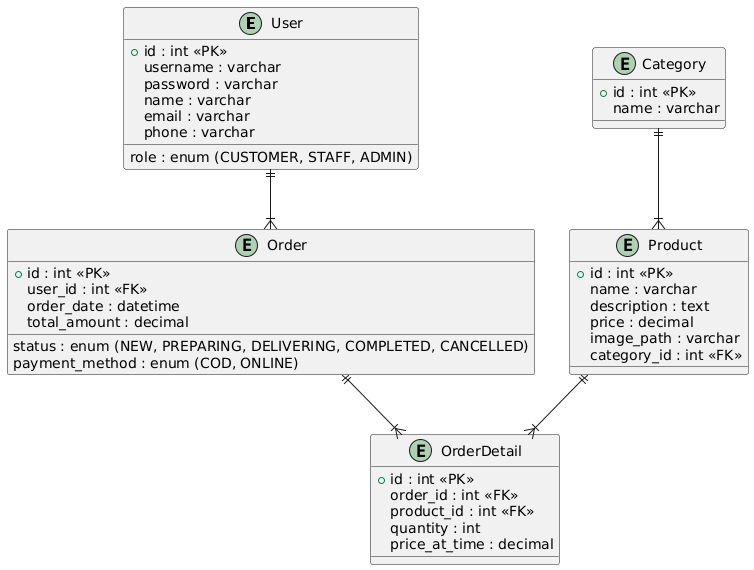

# 🍔 QuickMeal - Fullstack Food Ordering

**QuickMeal** là **hệ thống đặt đồ ăn trực tuyến** dành cho cửa hàng nhỏ, bao gồm:

- **Frontend:** ReactJS (SPA)
- **Backend:** Spring Boot 3.5.6 REST API

Hệ thống hỗ trợ quản lý **menu, đơn hàng, người dùng**, tích hợp **thanh toán trực tuyến** và liên kết frontend-backend thông qua **API chuẩn REST**.

---

## 🔹 Tính năng nổi bật

### Backend (Spring Boot REST API)

- Quản lý **Menu**: CRUD danh mục & món ăn
- Quản lý **Đơn hàng**: tạo, cập nhật, trạng thái, lịch sử
- Quản lý **Người dùng**: đăng ký, đăng nhập, phân quyền
- Thanh toán trực tuyến (**Payment Gateway**)
- API chuẩn để tích hợp với frontend

### Frontend (ReactJS)

- Giao diện trực quan, responsive
- Xem menu, thêm món vào giỏ hàng, đặt món
- Quản lý đơn hàng cá nhân
- Đăng nhập/đăng ký người dùng
- Thanh toán trực tuyến

---

## 📐 Kiến trúc & Thiết kế hệ thống

### 🔹 UML – Tổng quan kiến trúc & luồng xử lý

> Sơ đồ UML mô tả mối quan hệ giữa các module chính trong hệ thống QuickMeal, bao gồm User, Menu, Order, Payment và các Service tương ứng.

---

### 🔹 ERD – Thiết kế cơ sở dữ liệu

> ERD thể hiện cấu trúc database, các bảng chính và mối quan hệ giữa User, Order, OrderItem, Menu, Category, Payment…

---

## 🔗 Tài nguyên & Hướng dẫn

- **Tài liệu tổng quan & hướng dẫn triển khai:** [QuickMeal DeepWiki](https://deepwiki.com/SQKhanh/QuickMeal)
- **Postman Workspace:** [QuickMeal Postman](https://khanhdz-quickmeal.postman.co/workspaces)
- **Spring Boot Project Starter:** [Spring Initializr](https://start.spring.io/#!type=gradle-project&language=java&platformVersion=3.5.6&packaging=jar&jvmVersion=21&groupId=com.quickmeal&artifactId=quickmeal-backend&name=QuickMeal&description=QuickMeal%20backend%3A%20REST%20API%20qu%E1%BA%A3n%20l%C3%BD%20menu%2C%20%C4%91%C6%A1n%20h%C3%A0ng%2C%20ng%C6%B0%E1%BB%9Di%20d%C3%B9ng%20v%C3%A0%20thanh%20to%C3%A1n%20tr%E1%BB%B1c%20tuy%E1%BA%BFn%20cho%20c%E1%BB%ADa%20h%C3%A0ng%20nh%E1%BB%8F&packageName=com.quickmeal.backend&dependencies=lombok,devtools,mysql,security,web,oauth2-resource-server,validation,data-jpa,actuator)

> ⚡ Mẹo: Tất cả tài liệu chi tiết về kiến trúc, biểu đồ UML, Use Case, ERD đều được cập nhật đầy đủ trên DeepWiki. Bạn chỉ cần tham khảo để triển khai hoặc trình bày báo cáo.

---

## 📞 Liên hệ

Nếu bạn có câu hỏi hoặc cần hỗ trợ:

- **Email:** vichuyen.123@gmail.com
- **Facebook:** [Khánh Dzai](https://www.facebook.com/khanhdepzai.pro/)

---

_QuickMeal - Đặt đồ ăn nhanh chóng, tiện lợi, hiện đại!_
